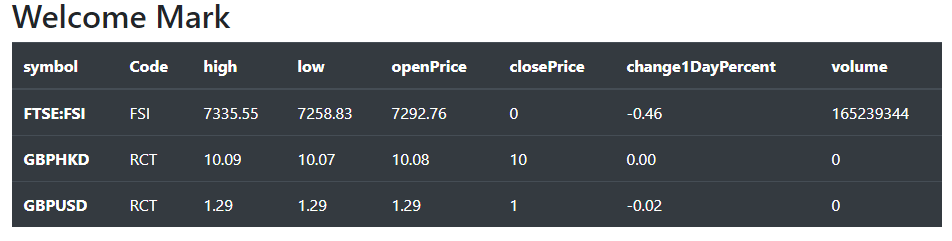
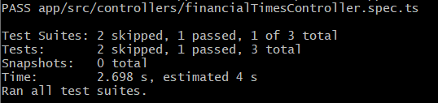

##### Mark Webley:

Repo: https://github.com/front-end-developer/mw-npm-module

npm: https://www.npmjs.com/package/mw-npm-module

##### About:
Nothing fancy just something experimental with node with typescript, & automated AWS CI / CD integration,
custom node module for artifacts / registry.

I set up the template to load dependencies like boostrap etc as is, so that it can run locally when off line for some reason during development, but I could set it up optionally to run off a CDN.

##### Features:
Basic Architecture | Node & Typescript | node (artifacts) registry | node module | node & Typescript | Jest Unit Test (spec) with node | Integration Test set up | typescript and Jest | services | API | Bootstrap

##### Dependency:

Node version at least Node 12.9.0 to use Promise.allSettled.

##### usefulness:

npm run dev

npm run stop

npm run prod

npm run stop && npm run tsc && npm run dev

npm run test

ROUTES:

http://localhost:3000

##### Results after request in datatable

##### Unit tests / Integration Tests

NOTE:

when you install eslint with npx eslint --init

you have to use powershell, because the normal terminal will not allow you to select the options.
